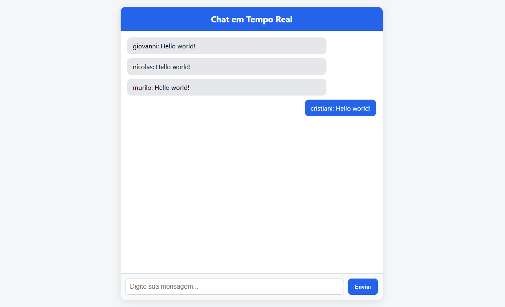

# 📡 Live Web Chat

<div align="center">
  

  ## **Live Web Chat**
  **Chat ao vivo em tempo real com Node.js, Socket.IO e Redis**

  <!-- Badges dinâmicas -->
  
  
  
  
  
  
</div>

## Sobre o Projeto

O **Live Web Chat** é uma aplicação de chat em tempo real construída com **Node.js**, **Express** e **Socket.IO**. O objetivo é permitir comunicação instantânea entre usuários via WebSocket, mantendo um histórico curto e escalável de mensagens. Utiliza **Redis** como *message broker* e como camada de persistência temporária, possibilitando que múltiplas instâncias do servidor compartilhem as mesmas conversas de forma transparente. A interface web responsiva em HTML e CSS oferece uma experiência simples e intuitiva.

Este projeto demonstra como resolver problemas de comunicação em tempo real, escalabilidade horizontal e armazenamento temporário de mensagens em uma arquitetura baseada em contêineres.

## Features

| Recurso | Descrição |
|---|---|
|Conexões WebSocket|Utiliza **Socket.IO** para comunicação bidirecional em tempo real entre cliente e servidor.|
|Escalabilidade Horizontal|Configuração com duas instâncias de aplicativo sincronizadas via **@socket.io/redis-adapter**, permitindo distribuição de carga.|
|Persistência Temporária|Armazena até 100 mensagens recentes no **Redis**, com verificação de timestamp para evitar mensagens antigas.|
|Interface Responsiva|Página web em **HTML/CSS** minimalista, com lista de mensagens, input de texto e rolagem automática.|
|Deploy via Docker Compose|Inclui **Dockerfile** e **docker‑compose.yml** para build e execução de múltiplas instâncias e do serviço Redis.|

## Demonstração / Screenshots
<div align="center">
  
</div>

## Arquitetura

O sistema é composto por uma camada de cliente, múltiplas instâncias do servidor Node.js e um banco de dados em memória (**Redis**) para sincronização e armazenamento temporário.

```
 Navegador/Cliente
        │
        │ Socket.IO (WebSocket)
        ▼
 ┌──────────────────────────────┐
 │  Node.js + Express (app1)    │
 ├──────────────────────────────┤
 │  Socket.IO + Redis Adapter   │
 └──────────────────────────────┘
        │
        │  (Compartilha mensagens via Redis)
        ▼
 ┌──────────────────────────────┐
 │  Node.js + Express (app2)    │
 ├──────────────────────────────┤
 │  Socket.IO + Redis Adapter   │
 └──────────────────────────────┘
        │
        ▼
  ┌───────────────┐
  │   Redis       │
  └───────────────┘
```

A arquitetura acima ilustra duas instâncias de aplicação (`app1` e `app2`) conectadas ao mesmo servidor Redis por meio do adaptador do Socket.IO. Isso permite que todas as mensagens emitidas por um usuário sejam propagadas a todas as instâncias, oferecendo alta disponibilidade e balanceamento de carga. Os navegadores se conectam a qualquer instância disponível e recebem eventos em tempo real.

## Tecnologias Utilizadas

- **Node.js 14+** – runtime JavaScript para o servidor.
- **Express 4.18.2** – framework web mínimo para roteamento e middleware.
- **Socket.IO 4.7.2** – biblioteca para WebSockets com fallback automáticos e fácil uso.
- **@socket.io/redis-adapter 8.2.0** – adaptador que utiliza Redis para sincronizar várias instâncias do Socket.IO.
- **ioredis 5.3.2** – cliente Redis robusto para Node.js.
- **Redis** (imagem oficial `redis:latest`) – armazenamento em memória utilizado como *message broker*.
- **Docker** e **Docker Compose** – para empacotar, orquestrar e escalar os serviços.
- **HTML5/CSS3/JavaScript** – tecnologias de frontend para a interface do chat.

## Instalação

### Pré‑requisitos

- **Node.js** e **npm** instalados caso deseje executar localmente sem Docker.
- **Docker** e **Docker Compose** (versão 2.0 ou superior) para ambiente em contêineres.

### Clonando o repositório

```bash
git clone https://github.com/giovannipereiradev/live-web-chat.git
cd live-web-chat
```

### Executando localmente (Node.js)

1. Acesse a pasta `src`:
   ```bash
   cd src
   ```
2. Instale as dependências:
   ```bash
   npm install
   ```
3. Inicie o servidor:
   ```bash
   node app.js
   ```
4. Abra seu navegador e acesse `http://localhost:1234/seu-nome` ou `http://localhost:5678/seu-nome`, 

### Executando com Docker Compose

1. Na raiz do projeto, execute o Docker Compose para construir as imagens e subir os serviços:
   ```bash
   docker-compose up --build
   ```
2. Acesse o chat através de um dos serviços expostos:
   - `http://localhost:1234/seu-nome` (primeira instância)
   - `http://localhost:5678/seu-nome` (segunda instância)
  
    Substituindo `seu-nome` pelo identificador desejado. Qualquer nome após a barra será tratado como nome de usuário.

Os dois serviços são idênticos; eles compartilham mensagens via Redis. Você pode abrir várias abas em diferentes portas para simular múltiplos usuários e verificar a replicação.

## Como Usar

1. Abra o navegador e acesse `http://localhost:PORT/seu-nome`.
2. Digite sua mensagem no campo de entrada e clique em **Enviar** ou pressione **Enter**.
3. As mensagens são exibidas em tempo real na lista, com diferenciação visual para as mensagens enviadas pelo próprio usuário.
4. Para cada novo usuário, basta acessar a URL com um nome diferente (por exemplo, `http://localhost:1234/Ana`). Várias abas ou navegadores diferentes podem participar simultaneamente.

Esta aplicação não expõe uma API REST; toda a comunicação ocorre via WebSockets utilizando **Socket.IO**. Se desejar integrar novos clientes (mobile ou desktop), utilize a biblioteca Socket.IO nos respectivos ambientes.

## Contribuição

Contribuições são bem‑vindas! Para contribuir:

1. **Faça um fork** do repositório.
2. Crie uma branch a partir da `main` utilizando um nome descritivo, por exemplo:
   ```bash
   git checkout -b feature/adicionar-autenticacao
   ```
3. Use o padrão **[Conventional Commits](https://www.conventionalcommits.org/pt-br/v1.0.0/)** para mensagens de commit (ex.: `feat: adicionar suporte a salas privadas`).
4. Após implementar e testar, **abra um Pull Request** descrevendo suas alterações.
5. Aguarde a revisão e feedback.